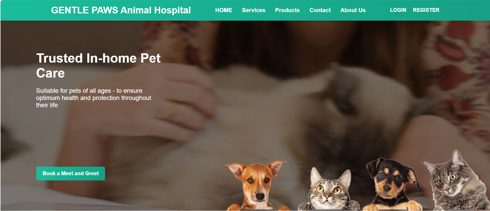
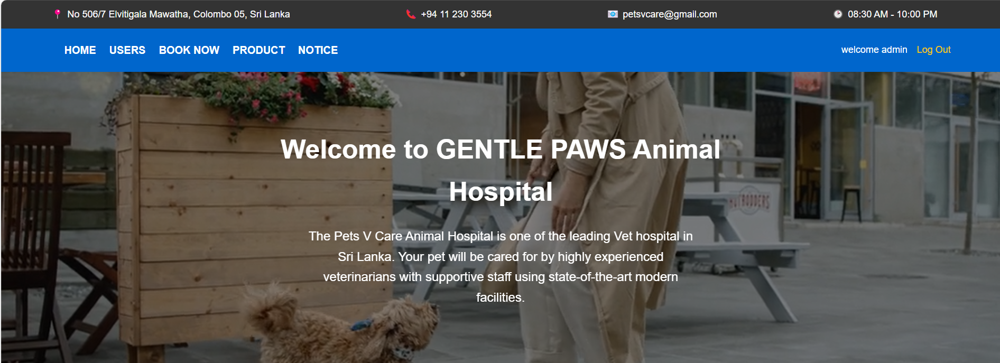
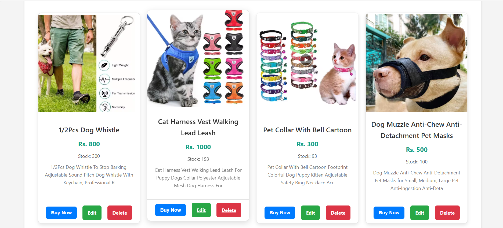

---

# **Gentle Paws Animal Hospital Website 🐾**

### **Project Overview**
Gentle Paws Animal Hospital is a responsive, user-friendly web application designed to streamline pet care services for both pet owners and hospital administrators. The platform offers features like online product browsing, easy appointment scheduling, and seamless user management. It aims to enhance the overall experience for pet care services.

---

### **Features**
- **Product Browsing**: View a range of pet care products with detailed descriptions and purchase options.
- **Appointment Booking**: Book veterinary appointments with an intuitive, streamlined interface.
- **Admin Panel**: Manage users, products, and appointments efficiently.
- **Payment Integration**: Secure and hassle-free payment gateway for transactions.
- **Special Notices Section**: Stay updated with the latest announcements from the hospital.

---

### **Technologies Used**
- **Frontend**: HTML, CSS, JavaScript
- **Backend**: PHP
- **Database**: MySQL
- **Other Tools**: 
  - Visual Studio Code for development
  - XAMPP for local hosting and database management

---

### **Project Structure**
```
📂 Gentle Paws Animal Hospital
├── 📂 assets
│   ├── 📂 css
│   ├── 📂 images
│   └── 📂 js
├── 📂 includes
│   ├── header.php
│   ├── footer.php
│   └── config.php
├── 📂 admin
│   ├── manage_users.php
│   ├── manage_products.php
│   └── dashboard.php
├── 📂 user
│   ├── login.php
│   ├── register.php
│   └── book_appointment.php
├── index.php
└── README.md
```

---

### **Installation Instructions**
1. **Clone the repository**:
   ```bash
   git clone https://github.com/your-username/gentle-paws.git
   ```
2. **Set up XAMPP**:
   - Place the project folder inside the `htdocs` directory.
   - Start Apache and MySQL services from the XAMPP control panel.
3. **Database Setup**:
   - Import the `gentle_paws.sql` file into your MySQL database.
   - Update `config.php` with your database credentials.
4. **Run the Project**:
   - Open your browser and navigate to `http://localhost/gentle-paws`.

---

### **Usage**
- **Admin Panel**:
  - URL: `http://localhost/gentle-paws/admin`
  - Manage users, products, and announcements.
- **User Interface**:
  - URL: `http://localhost/gentle-paws`
  - Browse products, book appointments, and view notices.

---

### **Screenshots**
#### Home Page:


#### Admin Dashboard:


#### Product Page:


---

### **Future Enhancements**
- Integration of email notifications for appointments.
- Adding support for multiple languages.
- Enhanced analytics in the admin panel for better insights.

---

### **License**
This project is licensed under the MIT License. See the [LICENSE](LICENSE) file for details.

---

### **Contributions**
Contributions are welcome! Please follow these steps:
1. Fork the repository.
2. Create a new branch (`feature/your-feature-name`).
3. Commit your changes.
4. Submit a pull request.

---

### **Contact**
Feel free to reach out if you have any questions or suggestions:
- **Email**: hashanlahiru2068@gmail.com
- **GitHub**: [hashan991](https://github.com/hashan991)
- **LinkedIn**: [Hashan Lahiru](https://www.linkedin.com/in/hashan-lahiru-746283338)

---

### **How to Add This to Your GitHub Repository**
1. Update the `README.md` file in your project directory with this template.
2. Replace placeholder links like `path/to/homepage-screenshot.png` with actual paths or URLs.
3. Commit and push the changes to your GitHub repository.

